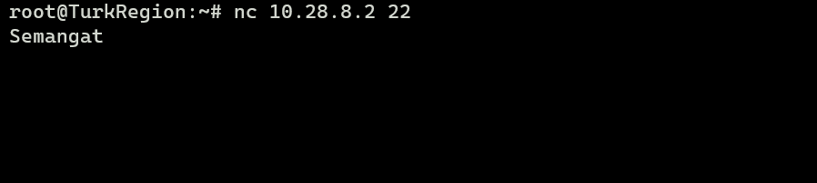

# Jarkom-Modul-5-D13-2023

<table>
<tbody>
  <thead>
    <tr>
      <th>Name</th>
      <th>NRP</th>
    </tr>
  </thead>
  <tbody>
    <tr>
      <td>Thalent Athalla Razzaq</td>
      <td>5025211101</td>
    </tr>
    <tr>
      <td> Jawahirul Wildan </td>
      <td> 5025211150 </td>
  </tbody>
</table>

Soal Dapat diakses pada [disini](https://docs.google.com/document/d/1VhSv39bFIjLpzn3_5u4l2phZCY3EDAGoKxNUObLNvNg/edit?usp=sharing)

## Topologi


## Preparation
(a) Tugas pertama, buatlah peta wilayah sesuai berikut ini:


Keterangan:<br>	Richter adalah DNS Server<br>
		Revolte adalah DHCP Server<br>
		Sein dan Stark adalah Web Server<br>
		Jumlah Host pada SchwerMountain adalah 64<br>
		Jumlah Host pada LaubHills adalah 255<br>
		Jumlah Host pada TurkRegion adalah 1022<br>
		Jumlah Host pada GrobeForest adalah 512<br>

(b) Untuk menghitung rute-rute yang diperlukan, gunakan perhitungan dengan metode VLSM. Buat juga pohonnya, dan lingkari subnet yang dilewati.

1. Penentuan Netmask<br>
Berikut tabel subnet yang digunakan untuk menentukan kebutuhan netmask dari setiap node.


2. Pembagian IP<br>
Dibuatkan tree dari penentuan subnet dan node root. Berdasarkan tree VLSM yang dibuat, didapatkan pembagian alamat IP dari setiap subnet.


3. Hasil VLSM<br>
Berikut hasil akhir dari pembagian alamat IP VLSM yang dimasukkan ke dalam tabel untuk memudahkan proses routing dan penyetelan setiap node.

<br>

**Aura**
```
auto eth0
iface eth0 inet static
	address 192.168.122.2
	netmask 255.255.255.252
	gateway 192.168.122.1

auto eth1
iface eth1 inet static
	address 10.28.14.129
	netmask 255.255.255.252

auto eth2
iface eth2 inet static
	address 10.28.14.149
	netmask 255.255.255.252
```

**Heiter**
```
auto eth0
iface eth0 inet static
	address 10.28.14.150
	netmask 255.255.255.252
	gateway 10.28.14.149

auto eth1
iface eth1 inet static
	address 10.28.0.1
	netmask 255.255.248.0

auto eth2
iface eth2 inet static
	address 10.28.8.1
	netmask 255.255.252.0
```

**Frieren**
```
auto eth0
iface eth0 inet static
	address 10.28.14.130
	netmask 255.255.255.252
	gateway 10.28.14.129

auto eth1
iface eth1 inet static
	address 10.28.14.133
	netmask 255.255.255.252

auto eth2
iface eth2 inet static
	address 10.28.14.145
	netmask 255.255.255.252
```

**Himmel**
```
auto eth0
iface eth0 inet static
	address 10.28.14.134
	netmask 255.255.255.252
	gateway 10.28.14.133

auto eth1
iface eth1 inet static
	address 10.28.12.1
	netmask 255.255.254.0

auto eth2
iface eth2 inet static
	address 10.28.14.1
	netmask 255.255.255.128
```

**Fern**
```
auto eth0
iface eth0 inet static
	address 10.28.14.2
	netmask 255.255.255.128
	gateway 10.28.14.1

auto eth1
iface eth1 inet static
	address 10.28.14.137
	netmask 255.255.255.252

auto eth2
iface eth2 inet static
	address 10.28.14.141
	netmask 255.255.255.252
```

**Richter**
```
auto eth0
iface eth0 inet static
	address 10.28.14.138
	netmask 255.255.255.252
	gateway 10.28.14.137
```

**Revolte**
```
auto eth0
iface eth0 inet static
	address 10.28.14.142
	netmask 255.255.255.252
	gateway 10.28.14.141
```

**Sein**
```
auto eth0
iface eth0 inet static
	address 10.28.8.2
	netmask 255.255.252.0
	gateway 10.28.8.1
```

**Stark**
```
auto eth0
iface eth0 inet static
	address 10.28.14.146
	netmask 255.255.255.252
	gateway 10.28.14.145
```

**TurkRegion**
```
auto eth0
iface eth0 inet dhcp
```

**GrobeForest**
```
auto eth0
iface eth0 inet dhcp
```

**LaubHills**
```
auto eth0
iface eth0 inet dhcp
```

**SchwerMountains**
```
auto eth0
iface eth0 inet dhcp
```

(c) Kemudian buatlah rute sesuai dengan pembagian IP yang kalian lakukan.<br>
Berikut ini merupakan routing sesuai dengan pembagian IP<br>
**Aura**
```
route add -net 10.28.12.0 netmask 255.255.252.0 gw 10.28.14.130 # A2 - A7
route add -net 10.28.0.0 netmask 255.255.248.0 gw 10.28.14.150 # A9
route add -net 10.28.8.0 netmask 255.255.252.0 gw 10.28.14.150 # A10
```

**Heiter**
```
route add -net 0.0.0.0 netmask 0.0.0.0 gw 10.28.14.149
```

**Frieren**
```
route add -net 0.0.0.0 netmask 0.0.0.0 gw 10.28.0.129
route add -net 10.28.12.0 netmask 255.255.254.0 gw 10.28.14.134 # A3
route add -net 10.28.14.0 netmask 255.255.255.128 gw 10.28.14.134 # A4
route add -net 10.28.14.136 netmask 255.255.255.248 gw 10.28.14.134 # A5 - A6
```

**Himmel**
```
route add -net 0.0.0.0 netmask 0.0.0.0 gw 10.28.0.133
route add -net 10.28.14.136 netmask 255.255.255.248 gw 10.28.14.2 # A5 - A6
```

**Fern**
```
route add -net 0.0.0.0 netmask 0.0.0.0 gw 10.28.14.1
```

(d) Tugas berikutnya adalah memberikan ip pada subnet SchwerMountain, LaubHills, TurkRegion, dan GrobeForest menggunakan bantuan DHCP.<br>
Pertama, pada Revolte (DHCP Server) jalankan perintah 
```
apt-get update
apt-get install isc-dhcp-server -y
```
Kedua, edit file pada di ```/etc/default/isc-dhcp-server``` seperti dibawah ini
```
echo 'INTERFACESv4="eth0"' > /etc/default/isc-dhcp-server
```
Ketiga, edit file di ```/etc/dhcp/dhcpd.conf``` seperti dibawah ini
```
echo 'option domain-name "example.org";
option domain-name-servers ns1.example.org, ns2.example.org;

default-lease-time 20000;
max-lease-time 50000;

ddns-update-style none;

authoritative;

subnet 10.28.14.128 netmask 255.255.255.252{
}
subnet 10.28.14.132 netmask 255.255.255.252{
}
subnet 10.28.12.0 netmask 255.255.254.0{
    range 10.28.12.2 10.28.13.254;
    option routers 10.28.12.1;
    option broadcast-address 10.28.13.255;
    option domain-name-servers 10.28.14.138;
}
subnet 10.28.14.0 netmask 255.255.255.128{
    range 10.28.14.3 10.28.14.126;
    option routers 10.28.14.1;
    option broadcast-address 10.28.14.127;
    option domain-name-servers 10.28.14.138;
}
subnet 10.28.14.136 netmask 255.255.255.252{
}
subnet 10.28.14.140 netmask 255.255.255.252{
}
subnet 10.28.14.144 netmask 255.255.255.252{
}
subnet 10.28.14.148 netmask 255.255.255.252{
}
subnet 10.28.0.0 netmask 255.255.248.0{
    range 10.28.0.2 10.28.7.254;
    option routers 10.28.0.1;
    option broadcast-address 10.28.7.255;
    option domain-name-servers 10.28.14.138;
}
subnet 10.28.8.0 netmask 255.255.252.0{
    range 10.28.8.3 10.28.11.254;
    option routers 10.28.8.1;
    option broadcast-address 10.28.11.255;
    option domain-name-servers 10.28.14.138;
}
' > /etc/dhcp/dhcpd.conf
```
Keempat, lakukan restart pada dhcp server
```
service isc-dhcp-server restart
```
Pada setiap router, diatur dhcp relay seperti dibawah ini<br>
Pertama, jalankan perintah
```
apt-get update
apt-get install isc-dhcp-relay -y
```
Kedua, lakukan edit pada ```/etc/default/isc-dhcp-relay``` seperti dibawah ini
```
echo 'SERVERS="10.28.14.142"
INTERFACES="eth0 eth1 eth2"
OPTIONS=""
' > /etc/default/isc-dhcp-relay
```
Ketiga, lakukan edit pada ```/etc/sysctl.conf``` seperti dibawah ini
```
echo 'net.ipv4.ip_forward=1' > /etc/sysctl.conf
```
Keempat, lakukan start pada dhcp relay
```
service isc-dhcp-relay start
```

## Soal 1
Agar topologi yang kalian buat dapat mengakses keluar, kalian diminta untuk mengkonfigurasi Aura menggunakan iptables, tetapi tidak ingin menggunakan MASQUERADE.<br>
Jalankan perintah berikut pada node Aura
```bash
iptables -t nat -A POSTROUTING -o eth0 -j SNAT -s 10.28.0.0/20 --to-source 192.168.122.2
```
### Testing
Lakukan perintah berikut pada sembarang node
```bash
ping google.com
```


## Soal 2
Kalian diminta untuk melakukan drop semua TCP dan UDP kecuali port 8080 pada TCP.<br>
Jalankan perintah berikut pada salah satu client
```bash
iptables -N NO_2
iptables -A NO_2 -p tcp -m multiport ! --dport 8080 -j LOG
iptables -A NO_2 -p tcp -m multiport ! --dport 8080 -j DROP
iptables -A NO_2 -p udp -j LOG
iptables -A NO_2 -p udp -j DROP
iptables -A INPUT -j NO_2
```
### Testing
Lakukan perintah berikut pada salah satu client yang berbeda. Untuk TCP(pastikan hanya bisa untuk 8080)
```bash
nc -l -p 8080 #di client yang menjalankan iptables
nc <ip> 8080 #di client yang berbeda
```
Untuk UDP
```bash
nc -u -l -p 8080 #di client yang menjalankan iptables
nc -u <ip> 8080 #di client yang berbeda
```


## Soal 3
Kepala Suku North Area meminta kalian untuk membatasi DHCP dan DNS Server hanya dapat dilakukan ping oleh maksimal 3 device secara bersamaan, selebihnya akan di drop.<br>
Jalankan perintah berikut pada Revolte dan Ritcher
```bash
iptables -N NO_3
iptables -A NO_3 -p icmp --icmp-type echo-request -m conntrack --ctstate RELATED,ESTABLISHED -j ACCEPT
iptables -A NO_3 -p icmp --icmp-type echo-request -m connlimit --connlimit-above 3 --connlimit-mask 0 -j LOG
iptables -A NO_3 -p icmp --icmp-type echo-request -m connlimit --connlimit-above 3 --connlimit-mask 0 -j DROP
iptables -A INPUT -j NO_3

```
### Testing
Lakukan perintah berikut pada semua client (pastikan di client 4 ping tidak berjalan)
```bash
ping 10.28.14.142 #ip revolte
ping 10.28.14.138 #ip ritcher
```
Testing untuk IP Ritcher<br>
Client 1

Client 2

Client 3

Client 4


Testing untuk IP Revolte<br>
Client 1

Client 2

Client 3

Client 4


## Soal 4
Lakukan pembatasan sehingga koneksi SSH pada Web Server hanya dapat dilakukan oleh masyarakat yang berada pada GrobeForest.<br>
Jalankan perintah berikut pada Stark dan Sein
```bash
iptables -N NO_4
iptables -A NO_4 -p tcp --dport 22 -m iprange ! --src-range 10.28.8.3-10.28.11.254 -j LOG
iptables -A NO_4 -p tcp --dport 22 -m iprange ! --src-range 10.28.8.3-10.28.11.254 -j DROP
iptables -A INPUT -j NO_4
```

### Testing
Lakukan perintah berikut pada stark dan sein secara bergantian
```bash
nc -l -p 22
```
Lakukan perintah berikut pada client (pastikan hanya Grobeforest yang bisa komunikasi)
```bash
nc 10.28.14.146 22 #ip stark
nc 10.28.8.2 22 #ip sein
```
Testing pada 3 Client yang bukan Grobeforest ke IP Stark


Tidak Terjadi perubahan pada node Stark


Testing pada GrobeForest ke IP Stark


Testing pada 3 Client yang bukan Grobeforest ke IP Sein



Tidak Terjadi perubahan pada node Sein


Testing pada GrobeForest ke IP Sein


## Soal 5
Selain itu, akses menuju WebServer hanya diperbolehkan saat jam kerja yaitu Senin-Jumat pada pukul 08.00-16.00.<br>
Jalankan perintah berikut pada stark dan sein
```bash
iptables -N NO_5
iptables -A NO_5 -m time --weekdays Sat,Sun -j LOG
iptables -A NO_5 -m time --weekdays Sat,Sun -j DROP
iptables -A NO_5 -m time --weekdays Mon,Tue,Wed,Thu,Fri --timestart 00:00 --timestop 07:59 -j LOG
iptables -A NO_5 -m time --weekdays Mon,Tue,Wed,Thu,Fri --timestart 00:00 --timestop 07:59 -j DROP
iptables -A NO_5 -m time --weekdays Mon,Tue,Wed,Thu,Fri --timestart 16:01 --timestop 23:59 -j LOG
iptables -A NO_5 -m time --weekdays Mon,Tue,Wed,Thu,Fri --timestart 16:01 --timestop 23:59 -j DROP
iptables -A INPUT -j NO_5
```


### Testing
Ubahlah date pada gns dengan perintah sebagai berikut(dapat dijalankan di node mana saja)
```bash
date -s "19 DEC 2023 09:00"
```

Lakukan perintah berikut pada Grobeforest secara bergantian
```bash
ping 10.28.14.146 #ip stark
ping 10.28.8.2 #ip sein
```
Testing dengan IP Sein

Testing dengan IP Stark


## Soal 6
Lalu, karena ternyata terdapat beberapa waktu di mana network administrator dari WebServer tidak bisa stand by, sehingga perlu ditambahkan rule bahwa akses pada hari Senin - Kamis pada jam 12.00 - 13.00 dilarang (istirahat maksi cuy) dan akses di hari Jumat pada jam 11.00 - 13.00 juga dilarang (maklum, Jumatan rek).<br>
Jalankan perintah berikut pada Stark dan Sein
```bash
iptables -N NO_6
iptables -A NO_6 -m time --timestart 12:00 --timestop 13:00 --weekdays Mon,Tue,Wed,Thu -j LOG
iptables -A NO_6 -m time --timestart 12:00 --timestop 13:00 --weekdays Mon,Tue,Wed,Thu -j DROP
iptables -A NO_6 -m time --timestart 11:00 --timestop 13:00 --weekdays Fri -j LOG
iptables -A NO_6 -m time --timestart 11:00 --timestop 13:00 --weekdays Fri -j DROP
iptables -A INPUT -j NO_6
```
### Testing
Ubahlah date pada gns dengan perintah sebagai berikut(dapat dijalankan di node mana saja)
```bash
date -s "20 DEC 2023 12:05"
```

atau
```bash
date -s "22 DEC 2023 12:55"
```

Lakukan perintah berikut pada Grobeforest secara bergantian
```bash
ping 10.28.14.146 #ip stark
ping 10.28.8.2 #ip sein
```
Testing dengan IP Sein

Testing dengan IP Stark


## Soal 7
Karena terdapat 2 WebServer, kalian diminta agar setiap client yang mengakses Sein dengan Port 80 akan didistribusikan secara bergantian pada Sein dan Stark secara berurutan dan request dari client yang mengakses Stark dengan port 443 akan didistribusikan secara bergantian pada Sein dan Stark secara berurutan.
Jalankan perintah berikut pada Frieren
```bash
iptables -t nat -N NO_7
iptables -A NO_7 -t nat -p tcp --dport 443 -d 10.28.14.146 -m statistic --mode nth --every 2 --packet 0 -j DNAT --to-destination 10.28.8.2
iptables -A NO_7 -t nat -p tcp --dport 443 -d 10.28.14.146 -j DNAT --to-destination 10.28.14.146
iptables -t nat -A PREROUTING -j NO_7
```
Jalankan perintah berikut pada Heiter
```bash	
iptables -t nat -N NO_7
iptables -A NO_7 -t nat -p tcp --dport 80 -d 10.28.8.2 -m statistic --mode nth --every 2 --packet 0 -j DNAT --to-destination 10.28.8.2
iptables -A NO_7 -t nat -p tcp --dport 80 -d 10.28.8.2 -j DNAT --to-destination 10.28.14.146
iptables -t nat -A PREROUTING -j NO_7
```
### Testing
Jalankan pada Sein dan Stark untuk testing port 80
```bash
while true; do nc -l -p 80 -c 'echo "ini sein"'; done

while true; do nc -l -p 80 -c 'echo "ini stark"'; done
```
Jalankan pada sembarang client untuk testing port 80
```bash
nc 10.28.8.2 80
```

Jalankan pada Sein dan Stark untuk testing port 443
```bash
while true; do nc -l -p 443 -c 'echo "ini sein"'; done

while true; do nc -l -p 443 -c 'echo "ini stark"'; done
```
Jalankan pada sembarang client untuk testing port 443
```bash
nc 10.28.14.146 443
```


## Soal 8
Karena berbeda koalisi politik, maka subnet dengan masyarakat yang berada pada Revolte dilarang keras mengakses WebServer hingga masa pencoblosan pemilu kepala suku 2024 berakhir. Masa pemilu (hingga pemungutan dan penghitungan suara selesai) kepala suku bersamaan dengan masa pemilu Presiden dan Wakil Presiden Indonesia 2024.<br>
Jalankan perintah berikut pada Fern
```bash
iptables -N NO_8
iptables -A NO_8 -s 10.28.14.140/30 -d 10.28.8.2 -m time --datestop 2024-06-27 -j LOG
iptables -A NO_8 -s 10.28.14.140/30 -d 10.28.8.2 -m time --datestop 2024-06-27 -j DROP
iptables -A NO_8 -s 10.28.14.140/30 -d 10.28.14.146 -m time --datestop 2024-06-27 -j LOG
iptables -A NO_8 -s 10.28.14.140/30 -d 10.28.14.146 -m time --datestop 2024-06-27 -j DROP
iptables -A FORWARD -j NO_8
```
### Testing
Jalankan pada node ``Revolte`` mengarah pada salah satu webserver
```bash
ping 10.28.8.2 #Sein
```
Karena date pada node ``Revolte`` belum sampai berakhirnya masa pemilu, maka tidak bisa ngeping node ``Webserver``


## Soal 9
Sadar akan adanya potensial saling serang antar kubu politik, maka WebServer harus dapat secara otomatis memblokir  alamat IP yang melakukan scanning port dalam jumlah banyak (maksimal 20 scan port) di dalam selang waktu 10 menit. 
(clue: test dengan nmap)
Jalankan perintah berikut di Stark dan Sein
```
iptables -N NO_9
iptables -A NO_9 -m recent --name scan --update --seconds 600 --hitco$iptables -A NO_9 -m recent --name scan --update --seconds 600 --hitco$iptables -A NO_9 -m recent --name scan --set -j ACCEPT
iptables -A INPUT -j NO_9
```
### Testing
Pada sembarang client, jalankan perintah berikut
```bash
ping 10.28.14.146 #Stark
```
Setelah 20 kali nge-ping Sein, maka setalah itu tidak bisa nge-ping kembali


## Soal 10
Karena kepala suku ingin tau paket apa saja yang di-drop, maka di setiap node server dan router ditambahkan logging paket yang di-drop dengan standard syslog level.

### Testing
Log sudah terdapat pada sebagian besar perintah iptables
